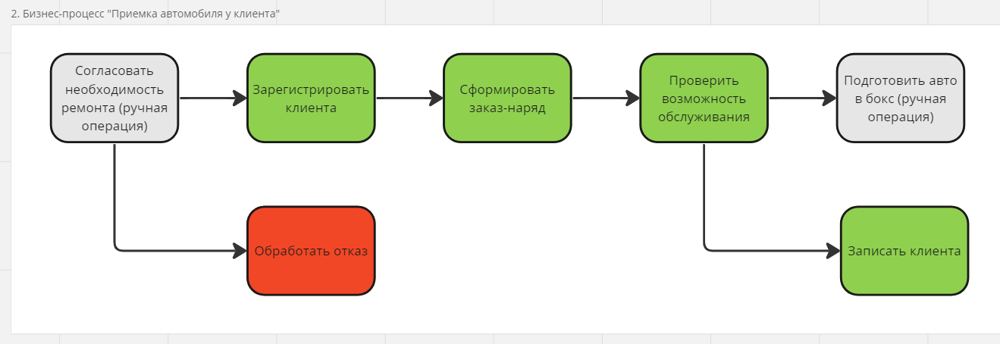
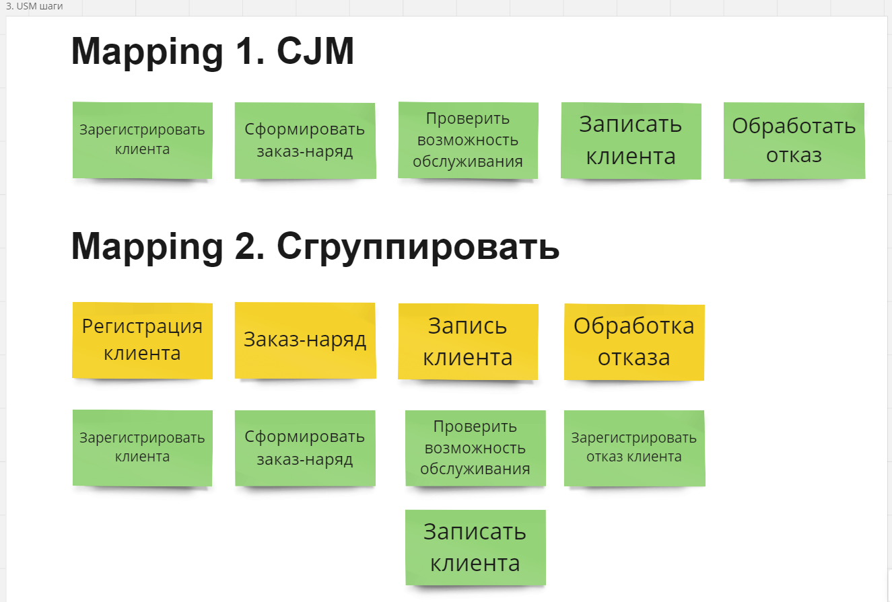
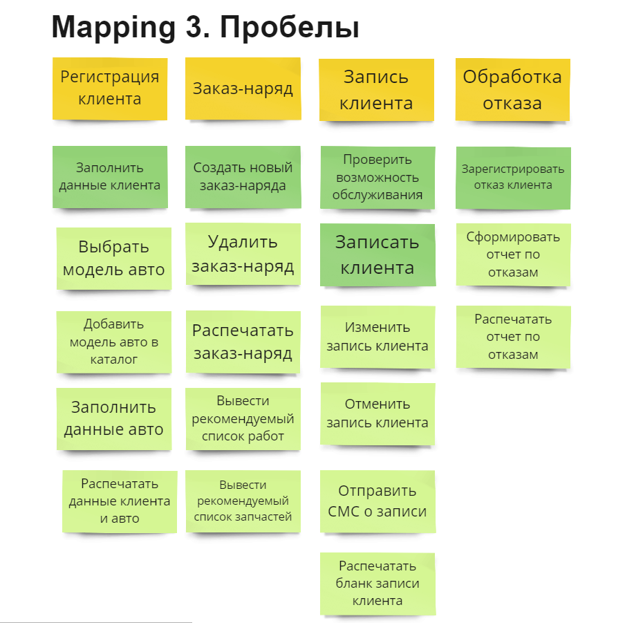
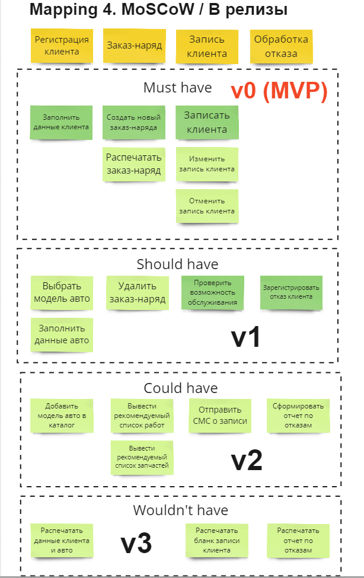

# 9. Описание требований в виде User Story

Оригинал схемы см. [https://miro.com/app/board/uXjVMi63E54=/](https://miro.com/app/board/uXjVMi63E54=/?share_link_id=532241918082)

# 9.1 Бизнес-процесс “Приемка автомобиля у клиента”

# 9.2 Построение карты User Story mapping

# 9.3 User Stories/Acceptance Criteria

| US01. Я, как мастер, хочу заполнить данные клиента, чтобы подставлять их в заказ-наряды. |
| --- |
| Критерии приемки:
1. Данные клиента сохраняются в справочнике клиентов.
2. У мастера есть права на добавление клиента в справочник.
3. В форме создания есть все необходимые поля:
- ФИО клиента
- номер ВУ
- телефон
4. Форма соответствует разработанному макету.
5. Осуществляется проверка на существование клиента и выводится предупреждение.
6. Осуществляется проверка на формат ВУ и выводится предупреждение. |
| US02. Я, как мастер, хочу создать новый заказ-наряд, чтобы сохранить запрос клиента. |
| Критерии приемки:
1. Заказ-наряд создан и сохранен.
2. У мастера есть права на создание заказ-наряда.
3. Форма соответствует разработанному макету
5. Есть кнопки создать и сохранить (приложить мокап).
6. В форме создания есть все необходимые поля:
Шапка:
- номер и дата заказ-наряда
- наименование СТО
- автор документа
- ФИО механика
- ФИО клиента
- модель авто клиента
- VIN
- регистрационный номер
- пробег
Табличная часть работы:
- работа
- количество
- цена
- стоимость
Табличная часть запчасти:
- название
- код
- количество
- цена
- стоимость |
| US03. Я, как мастер, хочу распечатать заказ-наряд, чтобы клиент имел бумажную копию. |
| Критерии приемки:
1. Печатная форма соответствует разработанному макету.
2. На форме заказ-наряда есть кнопки Предварительный просмотр и Печать, при нажатии на эти кнопки вызывается стандартная форма предварительного просмотра и печати.
3. Есть кнопка быстрой печати, в этом случае заказ-наряд отправляется на принтер по-умолчанию с настройками печати по-умолчанию. |
| US04. Я, как мастер, хочу записать клиента, чтобы в СТО была информация о предстоящих ремонтах, а клиенты могли выбрать удобное для них время. |
| Критерии приемки:
1. На форме записи клиента есть поля:
- ФИО клиента (выбирается из справочника)
- диапазон дат
- тип работ
- список свободных боксов
- список свободных механиков
- свободные диапазоны времени
2.  Форма соответствует разработанному макету
3. Если клиент отсутствует в справочнике, вызывается форма регистрации нового клиента.
4. Если мастер оставляет тип работ не выбранным, система выводит сообщение: “Тип работ не выбран, будут выведены все свободные боксы и мастера, подтверждаете? Да, Нет” 
5. Система не дает выбрать диапазон больше месяца. |
| US05. Я, как мастер, хочу изменить запись клиента, чтобы в СТО была актуальная информация о предстоящих ремонтах, а клиенты могли выбрать удобное для них время. |
| Критерии приемки:
1. Вызывается форма записи клиента с проставленными полями.
2. Редактируется только время записи.
3. На форме присутствует кнопка сброса, в этом случае система запросит диапазон дат и выведет список свободных боксов и мастеров для введенного диапазона дат. |
| US06. Я, как мастер, хочу отменить запись клиента чтобы в СТО была актуальная информация о предстоящих ремонтах. |
| Критерии приемки:
1. Запись клиента удаляется из списка записей клиентов.
2. Список записей клиентов выводится на соответствующей форме. Форма соответствует макету.
3. Выводится предупреждение: Вы уверены, что собираетесь удалить запись клиента? |
| US07. Я, как мастер, хочу проверить возможность обслуживания, чтобы клиент мог выбрать удобное для него время. |
| Критерии приемки:
1. На форме записи клиента присутствует поле диапазона дат.
2. Форма соответствует разработанному макету.
3. Система выведет список свободных боксов и мастеров для введенного диапазона дат.
4. На форме присутствует кнопка сброса, в этом случае система повторно запросит диапазон дат и выведет список свободных боксов и мастеров для введенного диапазона дат. |
| US08. Я, как мастер, хочу выбрать модель авто, чтобы предлагать клиенту релевантные работы и запчасти. |
| Критерии приемки:
1.  Модель авто выбирается из справочника на второй по порядку форме.
2.  Форма соответствует разработанному макету.
3. На форме присутствуют кнопки Назад и Далее для перехода на предыдущую (данные клиента) или следующую форму (данные авто) и кнопка Отмена для отмены введенных данных и возврата в главный экран программы. |
| US09. Я, как мастер, хочу заполнить данные авто, чтобы механики при ремонте не путали автомобили клиентов. |
| Критерии приемки:
1. На форме заполнения Данных авто присутствуют следующие поля:
- VIN
- регистрационный номер
2. Форма соответствует разработанному макету.
3. На форме присутствуют кнопки Назад для перехода на предыдущую (модель авто), Сохранить и кнопка Отмена для отмены введенных данных и возврата в главный экран программы.
4. Осуществляется проверка на ситуацию, если авто зарегистрировано на другого клиента и выводится вопрос: Изменить регистрацию авто на текущего клиента? |
| US10. Я, как мастер, хочу удалить заказ-наряд, чтобы в базе данных была отражена актуальная информация. |
| Критерии приемки:
1. Заказ-наряд клиента удаляется из списка заказ-нарядов и из базы данных.
2. У мастера есть права на удаление заказ-наряда.
3. Список заказ нарядов выводится на соответствующей форме. Форма соответствует макету.
4. Выводится предупреждение: Вы уверены, что собираетесь удалить заказ-наряд? |
| US11. Я, как мастер, хочу зарегистрировать отказ клиента, чтобы накапливать статистику для принятия решений по устранению причин отказов. |
| Критерии приемки:
1. Форма регистрации отказа клиента запускается автоматически при отмене созданного заказ-наряда.
2. Форма регистрации отказа клиента запускается из пункта меню Модули-Регистрация отказа.
3. На форме заполнения Данных авто присутствуют следующие поля:
  - клиент (заполняется из справочника клиентов или заполняется в свободной форме) (опционально)
  - типовая причина отказа (заполняется из справочника) (опционально)
  - комментарий (опционально)
4. Если мастер не заполнил ни причину отказа, ни комментарий, система выводит сообщение: “Заполните причину отказа или комментарий!” |
| US12. Я, как мастер, хочу добавить модель авто в каталог, чтобы не вносить ее каждый раз вручную. |
| Критерии приемки:
1. Запрос на добавление новой модели авто в каталог запускается автоматически при соблюдении следующих условий:
- пользователь в форме ввода модели авто ввел модель, отсутствующую в справочнике моделей авто.
- пользователь на вопрос: Модель авто отсутствует в справочнике. Отправить заявку на добавление авто в каталог? ответил Да. |
| US13. Я, как мастер, хочу вывести рекомендуемый список работ, чтобы быстро посчитать стоимость работ. |
| Критерии приемки:
1. Рекомендуемый список работ выводится на форме заказ-наряда автоматически после заполнения полей:
- ФИО клиента
- авто клиента
2. Если мастер случайно удаляет из предложенного списка работ нужную, система при сохранении выводит предупреждение: “Рекомендуемые работы были удалены, восстановить? Да, Нет, Не предупреждать.”
3. На форме выводится итоговая сумма за весь объем работ. |
| US14. Я, как мастер, хочу вывести рекомендуемый список запчастей, чтобы быстро посчитать стоимость запчастей. |
| Критерии приемки:
1. Рекомендуемый список запчастей выводится на форме заказ-наряда автоматически после заполнения полей:
- ФИО клиента
- авто клиента
2. Если мастер случайно удаляет из предложенного списка запчастей нужную, система при сохранении выводит предупреждение: “Рекомендуемые запчасти были удалены, восстановить? Да, Нет, Не предупреждать.”
3. На форме выводится итоговая сумма за все предложенные запчасти. |
| US15. Я, как мастер, хочу отправить СМС о записи, чтобы клиент не забыл о времени записи или не перепутал время. |
| Критерии приемки:
1. СМС отправляется автоматически на номер клиента после первого сохранения записи клиента.
2. СМС отправляется автоматически на номер клиента после изменения записи клиента.
3. СМС отправляется автоматически на номер клиента после удаления записи клиента. |
| US16. Я, как мастер, хочу сформировать отчет по отказам, чтобы сфокусироваться на наиболее часто возникающих причинах отказов. |
| Критерии приемки:
1. Отчет по отказам запускается из меню Отчеты-Отчет по отказам.
2. Для настройки отчета выводится форма, содержащая поля:
- начальная и конечная дата
- ФИО клиента (выбирается из справочника) (опционально)
- типовая причина отказа (заполняется из справочника) (опционально)
3. Форма соответствует разработанному макету. |
| US17. Я, как мастер, хочу распечатать данные клиента и авто, чтобы иметь бумажную копию. |
| Критерии приемки:
1. Печатная форма соответствует разработанному макету.
2. На форме справочника клиентов есть кнопки Предварительный просмотр и Печать, при нажатии на эти кнопки вызывается стандартная форма предварительного просмотра и печати.
3. Есть кнопка быстрой печати, в этом случае карточка клиента отправляется на принтер по-умолчанию с настройками печати по-умолчанию. |
| US18. Я, как мастер, хочу распечатать бланк записи клиента, чтобы клиент имел бумажную копию. |
| Критерии приемки:
1. Печатная форма соответствует разработанному макету.
2. На форме Запись клиентов есть кнопки Предварительный просмотр и Печать, при нажатии на эти кнопки вызывается стандартная форма предварительного просмотра и печати.
3. Есть кнопка быстрой печати, в этом случае Бланк записи клиента отправляется на принтер по-умолчанию с настройками печати по-умолчанию. |
| US19. Я, как мастер, хочу распечатать отчет по отказам, чтобы иметь бумажную копию. |
| Критерии приемки:
1. Печатная форма соответствует разработанному макету.
2. На форме настройки Отчета по отказам есть кнопки Предварительный просмотр и Печать, при нажатии на эти кнопки вызывается стандартная форма предварительного просмотра и печати.
3. Есть кнопка быстрой печати, в этом случае Отчет по отказам отправляется на принтер по-умолчанию с настройками печати по-умолчанию. |
